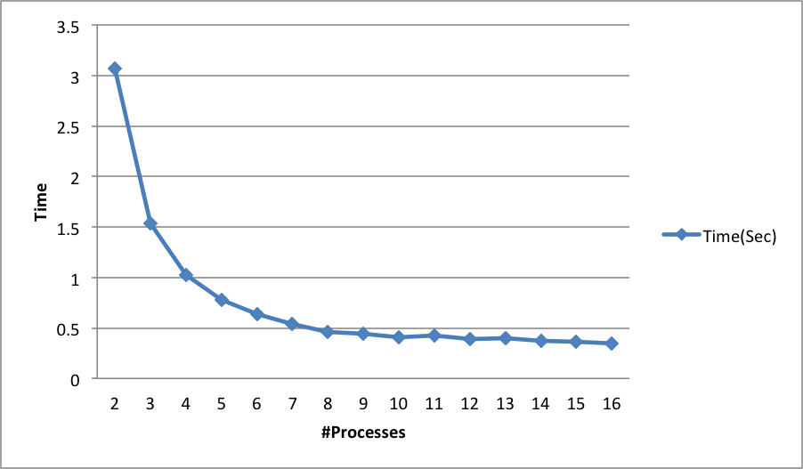

# Master Worker API
October 1, 2013

Chen Cao, Yiqiu Huang

##Part 1
In this part, we implemented an API to achieve Master-Worker parallelism.

The API is exposes three user-defined struct and three user-defined functions.

### API Specification

#### User-defined Data Structures
*	`work`: encapsulates a single unit of work to be done by a worker.
*	`result`: represent the result of work returned by the worker.
*	`meta`: (**Optional**) a general-purpose data structure that will pass to and consistent during `create` and `result` function calls.


####  User-defined Functions
*	`create`: return a list of works to be done. 
*	`compute`: takes a signle work and returns a result
*	`result`: take the list of results sent back from the workers and optionally combine them to get the actual result of the computation.

#### Entry Point
There should be a function to invoked by user to start the master worker configuration.

### API Implementation

API Reference of our implementation can be found at the [API Reference](#API_Reference) Section.

######Related Files
*	mw_api.h
*	mw_api.c

### API Testing

We migrated our dot product program from the previous lab to utilize the new API.

######Related Files
*	test.c

## Part2
In this part, we experimented with different grainularity, work number settings. The result is plotted below.


From the result, we can see that the perfomance boost we gain from adding workers is decreasing. The boost became almost indistinguishable once we reached 10 workers. The granularity is no longer signifcant after we hit 1000 division per worker.

######Related Files
*	largeintdiv.c

## Part3

The problem we are trying to solve is the string searching problem in a large file.

Human DNA whole genome sequencing is now become affordable to common people, to efficiently identify a signature DNA sequence from whole genome is very useful in personalized medicine and biomedical research. 

We implemented KMP algorithm on worker.

We exprimented with various worker numbers and found its performance saturated at about 9 workers. (which is consistent with out previous result). Further increasing of worker numbers only improve the performance marginally.



######Related Files
*	parallel_kmp.c


## [API Reference](id:API_Reference)

### Functions
#### [MW_Run](id:MW_Run)
```
void MW_Run (int argc, char **argv, struct mw_api_spec *spec);
```
This is the main entry point of the API. The command line arguments `argc` and `argv` should be passed in by the caller. The `f` parameter is the work specification given by user.
##### Parameters
 Name | Type | Value 
 -----|------|------- 
 argc | int | Command-line arguments 
 argv | char ** | Command-line arguments 
 spec | [mw_compute_func](#mw_api_spec) *| The user-defined work specification.

### Types

#### [mw_api_spec](id:mw_api_spec)
```
struct mw_api_spec
{
    mw_create_func create;
    mw_result_func result;
    mw_compute_func compute;
    int work_sz;
    int res_sz;
    int meta_sz;
};
```
##### Members
 Name | Type | Value 
 -----|------|-------
 create |[mw_create_func](#mw_create_func) | User-defined work creation function
 result | [mw_result_func](#mw_result_func)| User-defined result processing function
 compute | [mw_compute_func](#mw_compute_func)| User-defined work computation function
 work_sz | int | Work size in bytes
 res_sz | int | Result size in bytes
 meta_sz | int | Metadata size in bytes

#### [mw_works](id:mw_works)
```
struct mw_works
{
	int size;
	void *works;
};
```
##### Members
 Name | Type | Value 
 -----|------|-------
 size | int | Number of works in work array
 works | void * | Work array

### User-defined Functions

There are three user functions required in the specification.

* `mw_create_func` and `mw_result_func` are excuted in the master process.

* `mw_compute_func` is excuted in worker processes.

#### [mw_create_func](id:mw_create_func) *create*
```
mw_works* create (int argc, char **argv, void *meta);
```
The `mw_create_func` is where the user need to create a list of work to be processed.
The `argc` and `argv` are command line options. (Or, whatever passed to [`MW_Run`](#MW_Run)).
The `meta` is the user defined meta data struct that will persist across [`mw_create_func`](#mw_create_func) and [`mw_compute_func`](#mw_compute_func) calls. 
##### Parameters
 Name | Type | Value 
 -----|------|------- 
 argc | int | Command-line arguments 
 argv | char ** | Command-line arguments 
 meta | void * | User-defined metadata

##### Return
 Type | Value 
 -----|------ 
[mw_works](#mw_works) * | The generated work

#### [mw_result_func](id:mw_result_func) *result*
```
int result (int sz, void *res, void *meta);
```
##### Parameters
 Name | Type | Value 
 -----|------|------- 
 sz | int | Number of results in result array
 res | void * | Result array
 meta | void * | User-defined metadata
##### Return
 Type| Value 
 ----|------ 
 int | Status code

#### [mw_compute_func](id:mw_compute_func) *compute*
```
void* compute(void *work);
```
##### Parameters
 Name | Type | Value 
 -----|------|------- 
 work | void * | A single work to be computed
##### Return
 Type | Value 
 ----|------- 
 void * | Computed result, `NULL` if there is no result.
 
